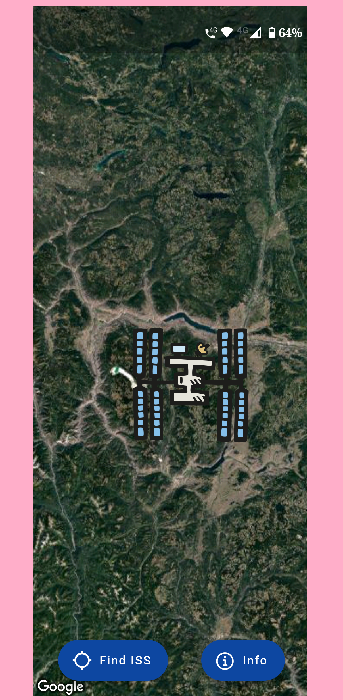
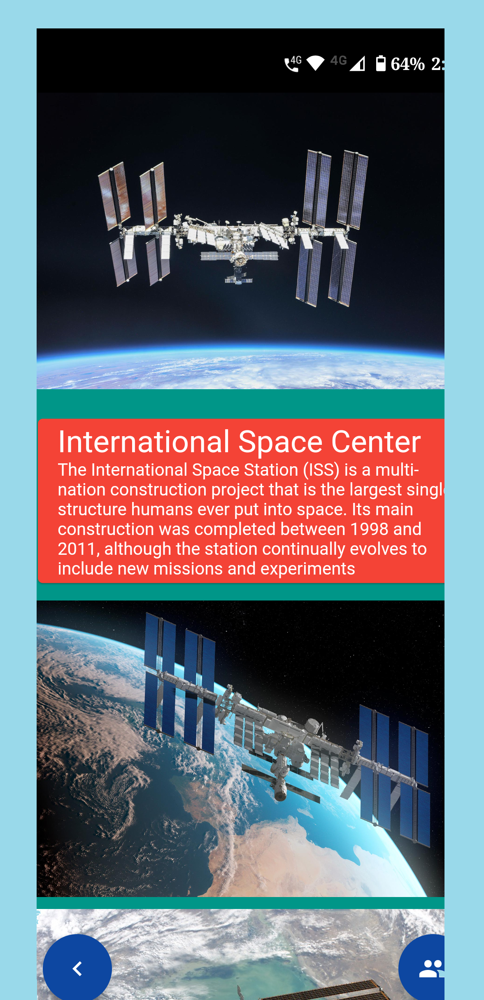
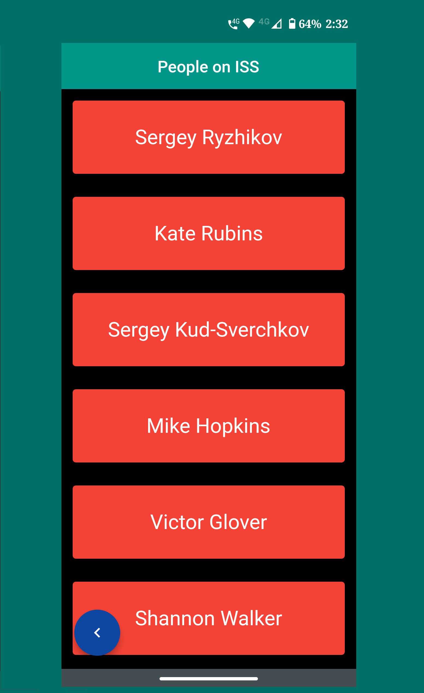

# ISS Tracker

 

## A Customized ISS Tracker for all the Space Lovers out there. 
 
 

## Features: 
- Get to know about ISS   
- Track International Space Center's Live Location   
- Know who is Currently Living on the International Space Center    
 

## Technolgies Used: 
- Flutter and Dart   
- Google Maps API   
- Open-Notify APIs    
 

## Screenshots: 
 

 

 

